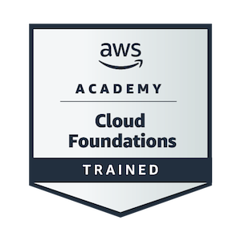

<h1 align="center">
  Hello, welcome to my profile! 
  
</h1>

  

  
  

---

## 👨‍💻 About Me

My passion is transforming complex problems into clear, scalable, and maintainable solutions. I'm the kind of developer who isn't satisfied with "magic" (🧙‍♂️). I'm convinced that everything has a reason and works somehow "under the hood" (⚙️).

I believe that software goes beyond code: my goal is to build products that **solve real problems** and deliver **business value**. For me, **collaboration** and **knowledge sharing** are the keys to the growth of teams and projects.

---

## 🚀 Technologies and Methodologies

Here's a summary of the tools and practices I use, ordered by my main focus:

### Cloud & DevOps

  
  
  
  
  
  
  

### Architecture, Processes & Methodologies

  
  
  

### Back-End & Runtimes

  
  

### Databases

  
  

### Front-End

  
  
  
  
  

---

## 🧠 Topics of Interest & Study Focus

These are the concepts that guide my work and that I'm always deepening:

  
  
  
  
  
  

  
  
  

  
  

---

## 🏆 Certifications and Badges

  

---

## 🌱 Current Focus (Learning and Deepening)

Technologies I am actively exploring to become a Solutions Architect, with a focus on orchestration, observability, and GitOps:

  
  
  
  

  
  
  
  
  
  

---

## 📊 My GitHub Stats

  
  

